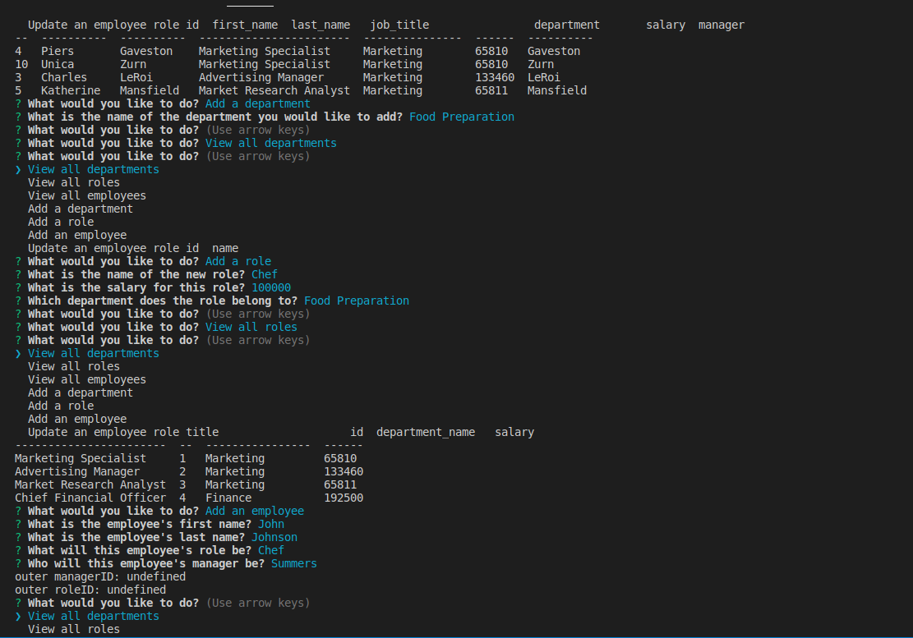

# Employee Tracker (SQL) 

This application is a content management system that allows users to manage a company's employee database.

The purpose of this challenge was to create a command-line application from scratch that manages such a database using Node.js, Inquirer, and MySQL.

## Usage
See my walkthrough [here](https://drive.google.com/file/d/1oKlquC55rEU4oDeYHDDA7-DOJVwrPkl_/view) to run the application on the command line.

It should look something like this:

## Built With
* JavaScript
* Node.js
* MySQL

## (Recently Learned) Skills Used
* configuring a Node.js application to connect to a MySQL database
* creating and dropping databases and tables
* using CRUD (create, read, update, delete) methods to work with persistent data
* creating schema and seed files for development
* writing join statements to establish relations between data in three separate tables using primary and foreign keys
